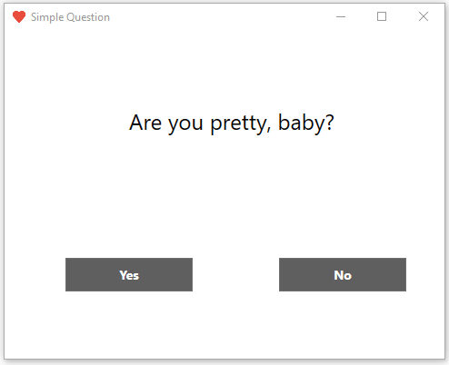
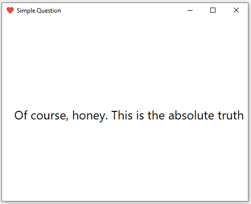
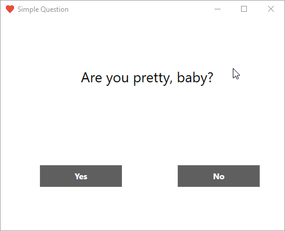

## What is SimpleQuestionApp? 😋
A simple WPF application with two pages. The first page contains a question and two buttons, one of which is static and the other one escapes on hover. The second page displays congratulations.




##### No button escape example 👅:


---

## How to use 🔨

Follow these steps to launch the application:

1. Clone this repository on your computer.
2. Open the project in Visual Studio (or other compatible development environment).
3. Build the project and make sure there are no compilation errors.
4. Run the application by selecting the entry point according to your project configuration.
---
## How to modify :trollface:

To change the text of the `yes` button, go to the `SimpleQuestionApp\Pages\QuestionPage.xaml` file and change the   `Content` property in the line:
```
<Button x:Name="yesButton" Content="Yes" .../>
```
To change the text of the `no` button, go to the `SimpleQuestionApp\Pages\QuestionPage.xaml` file and change the   `Content` property in the line:
```
<Button x:Name="noButton" Content="No" .../>
```
To change the question, go to the `SimpleQuestionApp\Pages\QuestionPage.xaml` file and change the   `Content` property in the line:
```
<Label x:Name="questionLabel"  Content="Are you pretty, baby?" .../>
```
To change the text of the congratulations, go to the `SimpleQuestionApp\Pages\CongratulationsPage.xaml` file and change the   `Content` property in the line:
```
<Label x:Name="congratulationLabel"  Content="Of course, honey. This is the absolute truth" .../>
```
## Your gratitude 💕
Subscribe to my **YouTube** channel - **https://www.youtube.com/@murmelus**

---
## Questions? 💬
Write to **murmelusblog@gmail.com**, but the best thing can be a comment under my video 😎